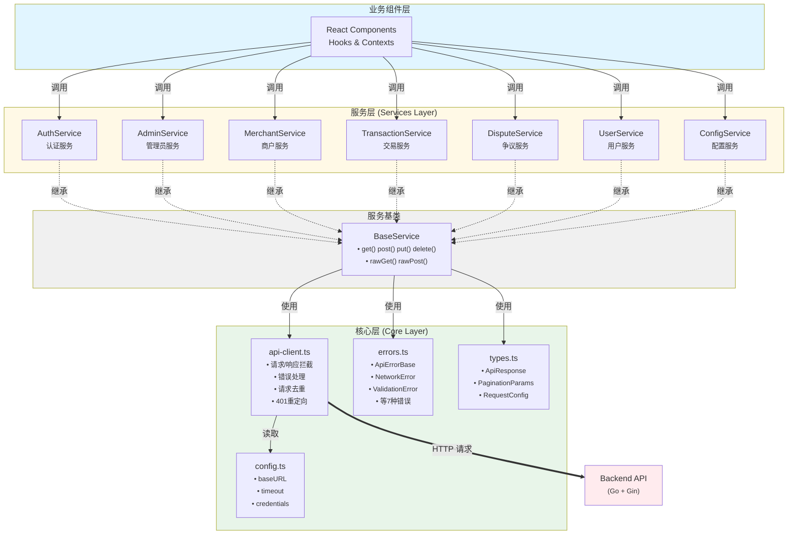

# 服务层架构文档

> **前端服务层** - 统一的 API 交互层，基于 TypeScript 和面向对象设计

## 架构设计

### 设计理念

服务层采用**分层架构**和**继承模式**，遵循以下核心原则：

1. **单一职责** - 每个服务模块负责一个业务领域
2. **类型安全** - 全量 TypeScript 类型定义，杜绝 `any`
3. **统一规范** - 所有服务遵循相同的设计模式
4. **错误分类** - 细粒度错误类型，便于精确处理
5. **可扩展性** - 基于继承的设计，易于添加新服务

---

## 架构分层




---

## 目录结构

```
lib/services/
├── core/                      # 核心基础设施层
│   ├── api-client.ts          # HTTP 客户端（请求拦截、错误处理）
│   ├── base.service.ts        # 服务基类（封装 CRUD 方法）
│   ├── config.ts              # API 配置（环境变量、超时等）
│   ├── errors.ts              # 错误类型定义（7种错误类型）
│   ├── types.ts               # 核心类型（ApiResponse、分页等）
│   └── index.ts               # 核心模块导出
│
├── auth/                      # 认证服务模块
│   ├── auth.service.ts        # OAuth 认证、登录、登出
│   ├── types.ts               # User、OAuthLoginUrlResponse 等
│   └── index.ts               # 模块导出 + 文档
│
├── admin/                     # 管理员服务模块
│   ├── admin.service.ts       # 系统配置、用户积分配置管理
│   ├── types.ts               # SystemConfig、UserPayConfig 等
│   └── index.ts               # 模块导出 + 文档
│
├── merchant/                  # 商户服务模块
│   ├── merchant.service.ts    # API Key、支付链接、订单管理
│   ├── types.ts               # MerchantAPIKey、PaymentLink 等
│   └── index.ts               # 模块导出 + 文档
│
├── transaction/               # 交易服务模块
│   ├── transaction.service.ts # 交易记录、转账
│   ├── types.ts               # Order、TransactionQueryParams 等
│   └── index.ts               # 模块导出 + 文档
│
├── dispute/                   # 争议服务模块
│   ├── dispute.service.ts     # 创建争议、退款审核
│   ├── types.ts               # Dispute、DisputeWithOrder 等
│   └── index.ts               # 模块导出 + 文档
│
├── user/                      # 用户服务模块
│   ├── user.service.ts        # 用户设置（支付密钥等）
│   ├── types.ts               # UpdatePayKeyRequest 等
│   └── index.ts               # 模块导出 + 文档
│
├── config/                    # 配置服务模块
│   ├── config.service.ts      # 获取公共配置
│   ├── types.ts               # PublicConfigResponse
│   └── index.ts               # 模块导出 + 文档
│
├── index.ts                   # 统一导出入口
└── README.md                  # 本文档
```

---

## 核心模块详解

### 1. BaseService - 服务基类

**职责**：为所有业务服务提供统一的 HTTP 方法封装

**关键设计**：
```typescript
export class BaseService {
  protected static readonly basePath: string = '';

  // 标准 RESTful 方法
  protected static async get<T>(path: string, params?: Record<string, unknown>): Promise<T>
  protected static async post<T>(path: string, data?: unknown): Promise<T>
  protected static async put<T>(path: string, data?: unknown): Promise<T>
  protected static async patch<T>(path: string, data?: unknown): Promise<T>
  protected static async delete<T>(path: string, params?: Record<string, unknown>): Promise<T>
  
  // 特殊端点支持（不遵循标准响应格式）
  protected static async rawGet<T>(url: string, params?: unknown): Promise<T>
  protected static async rawPost<T>(url: string, data?: unknown): Promise<T>
}
```

**设计优势**：
- ✅ 子类只需设置 `basePath`，无需重复实现 HTTP 逻辑
- ✅ 统一的响应解包（`response.data.data`）
- ✅ 类型安全的泛型设计
- ✅ 支持特殊端点（如 `/api.php`）

---

### 2. API Client - HTTP 客户端

**职责**：提供全局唯一的 Axios 实例，处理所有 HTTP 请求

**核心功能**：

#### 请求拦截器
- 自动添加 Cancel Token（支持请求取消）
- 请求去重（避免重复请求）

#### 响应拦截器
- **401 自动重定向** - 未授权时自动跳转登录页
- **错误分类** - 将 HTTP 状态码映射为具体错误类型
- **统一响应格式** - 解析 `ApiResponse<T>` 结构

#### 错误处理映射
| HTTP 状态码 | 错误类型 | 说明 |
|------------|---------|------|
| 400 | `ValidationError` | 参数验证失败 |
| 401 | 自动重定向 | 跳转到登录页 |
| 403 | `ForbiddenError` | 权限不足 |
| 404 | `NotFoundError` | 资源不存在 |
| 5xx | `ServerError` | 服务器错误 |
| 超时 | `TimeoutError` | 请求超时 |
| 网络 | `NetworkError` | 网络连接失败 |

---

### 3. 错误类型层级

```
ApiErrorBase (基类)
├── NetworkError          (网络连接错误)
├── TimeoutError          (请求超时)
├── UnauthorizedError     (401 - 未授权)
├── ForbiddenError        (403 - 权限不足)
├── NotFoundError         (404 - 资源不存在)
├── ValidationError       (400 - 参数验证失败)
└── ServerError           (5xx - 服务器错误)
```

**设计优势**：
- 支持 `instanceof` 类型判断
- 携带详细错误信息（`error_code`、`details`）
- 便于前端精确处理不同错误场景

---

## 开发规范

### 1. 服务类规范

#### 必须遵循
```typescript
export class SomeService extends BaseService {
  // 1. 必须继承 BaseService
  // 2. basePath 必须是 protected static readonly
  protected static readonly basePath = '/api/v1/resource';
  
  // 3. 方法必须是 static async
  // 4. 返回类型必须明确（禁止 any）
  static async getAll(): Promise<Resource[]> {
    return this.get<Resource[]>('/');
  }
  
  // 5. 参数类型必须明确定义在 types.ts
  static async create(request: CreateResourceRequest): Promise<Resource> {
    return this.post<Resource>('/', request);
  }
}
```

#### 方法命名规范
| 操作 | 命名 | 示例 |
|------|------|------|
| 获取列表 | `list*` 或 `getAll` | `listAPIKeys()` |
| 获取单个 | `get*` 或 `getById` | `getAPIKey(id)` |
| 创建 | `create*` | `createAPIKey(request)` |
| 更新 | `update*` | `updateAPIKey(id, request)` |
| 删除 | `delete*` | `deleteAPIKey(id)` |
| 特殊操作 | 动词开头 | `payMerchantOrder()` |

#### 方法排序规范
```typescript
export class SomeService extends BaseService {
  protected static readonly basePath = '/api/v1/resource';
  
  // 1. CRUD 操作（按 Create → Read → Update → Delete）
  static async create() { }
  static async list() { }
  static async get() { }
  static async update() { }
  static async delete() { }
  
  // 2. 其他业务方法（按业务逻辑分组）
  static async someAction() { }
}
```

---

### 2. 类型定义规范

#### types.ts 文件结构
```typescript
// 1. 类型别名（Type Aliases）
export type ResourceStatus = 'active' | 'inactive' | 'pending';

// 2. 枚举（Enums） - 使用 const enum 提升性能
export const enum ResourceLevel {
  Basic = 1,
  Premium = 2,
  Enterprise = 3,
}

// 3. 接口（Interfaces） - 按业务逻辑分组
/**
 * 资源信息
 */
export interface Resource {
  /** 资源 ID */
  id: number;
  /** 资源名称 */
  name: string;
  /** 状态 */
  status: ResourceStatus;
  /** 创建时间 */
  created_at: string;
}

/**
 * 创建资源请求
 */
export interface CreateResourceRequest {
  /** 资源名称（最大 50 字符） */
  name: string;
  /** 描述（可选，最大 200 字符） */
  description?: string;
}
```

#### 注释规范
- ✅ 所有 interface 必须有 JSDoc 描述
- ✅ 所有字段必须有行内注释
- ✅ 包含约束信息（长度、范围、格式等）
- ✅ 可选字段使用 `?` 标记

---

### 3. JSDoc 注释规范

**标准模板**：
```typescript
/**
 * [一句话描述方法功能]
 * 
 * @param paramName - 参数说明
 * @returns 返回值说明
 * @throws {ErrorType} 错误条件说明
 * 
 * @example
 * ```typescript
 * // 使用示例
 * const result = await Service.method({ param: 'value' });
 * ```
 * 
 * @remarks [可选]
 * - 业务规则或注意事项
 */
```

**示例**：
```typescript
/**
 * 创建商户 API Key
 * 
 * @param request - API Key 配置
 * @returns 创建的 API Key 信息
 * @throws {UnauthorizedError} 当未登录时
 * @throws {ValidationError} 当参数验证失败时
 * 
 * @example
 * ```typescript
 * const apiKey = await MerchantService.createAPIKey({
 *   app_name: '我的应用',
 *   app_homepage_url: 'https://example.com'
 * });
 * ```
 * 
 * @remarks
 * - app_name 最大 20 字符
 * - 需要登录权限
 */
static async createAPIKey(request: CreateAPIKeyRequest): Promise<MerchantAPIKey>
```

---

### 4. 模块 index.ts 规范

**标准格式**：
```typescript
/**
 * [模块名] 服务模块
 * 
 * @description
 * 提供 [业务领域] 相关的功能，包括：
 * - 功能点1
 * - 功能点2
 * - 功能点3
 * 
 * @example
 * ```typescript
 * import { ServiceName } from '@/lib/services';
 * 
 * // 使用示例（展示最常用的1-2个方法）
 * const result = await ServiceName.commonMethod();
 * ```
 * 
 * @remarks [可选]
 * - 特殊说明（如权限要求等）
 */

export { ServiceName } from './service-name.service';
export type * from './types';
// 或明确导出
export type {
  Type1,
  Type2,
} from './types';
```

---

## 创建新服务指南

### Step 1: 创建目录和文件
```bash
mkdir lib/services/resource
touch lib/services/resource/types.ts
touch lib/services/resource/resource.service.ts
touch lib/services/resource/index.ts
```

### Step 2: 定义类型（types.ts）
```typescript
export interface Resource {
  id: number;
  name: string;
}

export interface CreateResourceRequest {
  name: string;
}
```

### Step 3: 实现服务（resource.service.ts）
```typescript
import { BaseService } from '../core/base.service';
import type { Resource, CreateResourceRequest } from './types';

export class ResourceService extends BaseService {
  protected static readonly basePath = '/api/v1/resources';

  static async list(): Promise<Resource[]> {
    return this.get<Resource[]>('/');
  }

  static async create(request: CreateResourceRequest): Promise<Resource> {
    return this.post<Resource>('/', request);
  }
}
```

### Step 4: 导出模块（index.ts）
```typescript
/**
 * 资源服务模块
 * 
 * @description
 * 提供资源管理相关的功能，包括：
 * - 资源列表查询
 * - 资源创建
 */

export { ResourceService } from './resource.service';
export type * from './types';
```

### Step 5: 注册到统一入口（services/index.ts）
```typescript
import { ResourceService } from './resource';

const services = {
  // ... existing services
  resource: ResourceService,  // 新增
};

export default services;
export { ResourceService } from './resource';
export type * from './resource';
```

---

## 使用示例

```typescript
import services from '@/lib/services';

// 调用服务
const user = await services.auth.getUserInfo();
const transactions = await services.transaction.getTransactions({
  page: 1,
  page_size: 20
});

// 错误处理
import { UnauthorizedError, ValidationError } from '@/lib/services';

try {
  await services.merchant.createAPIKey(request);
} catch (error) {
  if (error instanceof UnauthorizedError) {
    router.push('/login');
  } else if (error instanceof ValidationError) {
    toast.error(error.message);
  }
}
```

---

## 注意事项

### 禁止事项
- ❌ 使用 `any` 类型
- ❌ 直接使用 `apiClient`（除非在 `BaseService` 内部）
- ❌ 绕过 BaseService 实现 HTTP 请求
- ❌ 在业务组件中直接导入 axios

### 必须遵循
- ✅ 所有服务继承 `BaseService`
- ✅ 使用 `protected static readonly basePath`
- ✅ 方法必须有完整的 JSDoc 注释
- ✅ 类型定义必须在 `types.ts` 中
- ✅ 通过 `services` 对象调用服务

---

## 相关文档

- [TypeScript 官方文档](https://www.typescriptlang.org/)
- [Axios 文档](https://axios-http.com/)
- [JSDoc 规范](https://jsdoc.app/)
